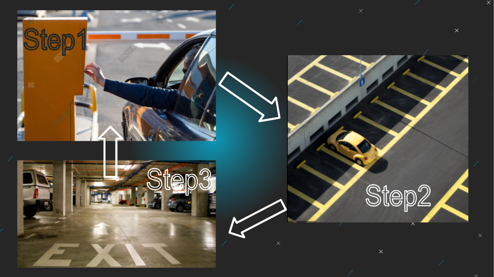

# VIP Car Parking Management System:

- This working project was designed, programmed for Arduino and made through my imagination.
- Feel free to fork, star it.✨
- Caution! VIPs only :)
 

### *This is how it works->*
    When all the slots are empty and the RFID card is scanned via RFID scanner and if it recognizes it then it will allow the car to be parked.
    If it’s an invalid card or the parking is full, then it will sound the buzzer and will not allow the car to go inside and red led will blink.
 

### *Pictorial Representation->*

### *Block Diagram Working->*
